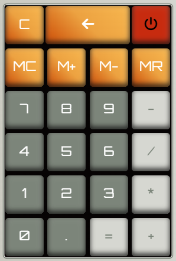
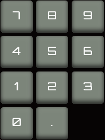
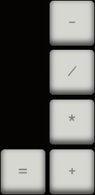
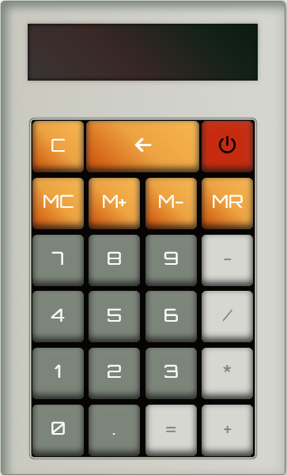

# Calculator

__What is a calculator?__ 

A calculator is a modern device that allows arithmetic operations on numbers, such as __addition__, __subtraction__, __multiplication__ and __division__ of mathematical equations, including, __exponential operations__, __trigonometric functions__, __square roots__, __logarithmic functions__, etc.

But the most basic calculator only performs four functions to handle operations, such as _addition_, _subtraction_, _multiplication_ and _division_.

For more information about the calculator, visit [what is a calculator?](https://www.techtarget.com/whatis/definition/calculator).

## Project Structure

```
└── 📁basic-calculator
    └── 📁assets
        └── 📁images
            └── block-keys.png
            └── block-one.png
            └── calculator.png
            └── memory-keys.png
            └── number-keys.png
            └── operator-keys.png
            └── screen.png
        └── favicon.ico
    └── 📁css
        └── styles.css
    └── 📁js
        └── main.js
    └── index.html
    └── README.md
```

### Calculator Parts

__Screen__


- The screen is an essential part of a calculator, because it allows you to view the result of a mathematical equation.

__Calculator Key Block__



Key block is a set of components that allow the user to perform basic mathematical operations, to display an operation and see its result on the screen.


__Firts Key Block__


- The __C__ button or __Clear__ button allows you to delete a value on the screen, when the result of a mathematical equation is not what you expected.

- The __Back Arrow__ button allows the user to delete a number each time the button is pressed.

- The __ON/OFF__ button allows the user to start or stop operation of the calculator.

__Memory Keys__


The memory buttons allows the user to save, delete, add or subtract numerical information stored in the calculator's internal storage, then use or delete it from an operation.

- __MC__ (Memory Clear): clear memory from calculator.
- __M+__ (Memory Plus): add a number to memory.
- __M-__ (Memory Subtract): subtract a number from memory.
- __MR__ (Memory Recall): retrieve a number from calculator's memory.

__Number Keys__



The number buttons allows the user to add a number or numbers to the screen, then use them in some mathematical operation.

__Operator Keys__



The operation button allows a favorable result to be obtained on the screen than expected, be it addition, subtraction, multiplication or division, when the user has chosen on of the options.

__Full calculator__

